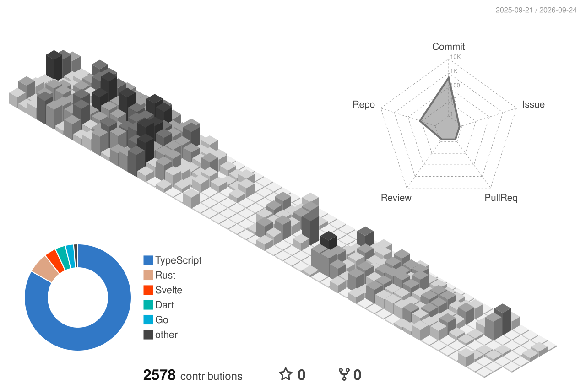

# Muhammad Hamza

Software engineer specializing in building and launching products. 
Robust systems · cloud-native architecture · high-performance APIs.

**Open to senior remote roles — backend · full-stack · AI (Go · TypeScript)**

Lahore, Pakistan · UTC+5 · remote

[`email`](mailto:hmzaawan88@gmail.com) · [`resume`](https://hamza.buzz/resume.pdf) · [`hamza.buzz`](https://hamza.buzz) · [`linkedin`](https://linkedin.com/in/mhamza88) · [`x`](https://x.com/hamzadotsh)

---

`NOW`

**Senior Software Engineer @ Afterlib** — built VibeSignals, a Meta-ads moderation and analysis product, end to end with TypeScript and Hono on the full Cloudflare stack (Workers, Workflows, Durable Objects, D1, KV, R2, Queues, Workers AI). AI pulls sentiment out of ad comments and extracts signals — recurring patterns, customer avatars — from the data.

---

`SELECTED WORK`

**[Simple Email API](https://simpleemailapi.dev)** — high-performance email API, p50 ≈ 39 ms 
`Go` · `Connect RPC` · `TanStack Start` · `PostgreSQL` · `Tinybird` · `Redis` · `AWS SES`

**[Page Report](https://pagereport.app)** — landing-page analysis by a swarm of parallel AI agents, serving 100+ users daily 
`Python` · `LangChain` · `GCP Cloud Run`

**[Researgent](https://researgent.com)** — AI-powered LaTeX editor for desktop and web, per-project Docker sandboxes 
`Rust` · `Tauri` · `Svelte`

**[MsgMorph](https://msgmorph.com)** — B2B post-signup feedback engine with SDKs and auth-engine plugins 
`Next.js` · `NestJS`

**[Piosphere](https://piosphere.ai)** — infrastructure OS for AI workloads (finetuning, agents, benchmarking) on self-hosted models 
`Go` · `Kubernetes` · `PostgreSQL` · `bare metal`

**[Smart Interview Coach](https://smartinterviewcoach.com)** — AI-generated interview practice with computer-vision behavior analysis 
`React` · `custom CV models`

---

`OPEN SOURCE`

**[better-auth-emails](https://www.npmjs.com/package/better-auth-emails)** — &lt;1.5 KB gzipped email plugin for Better Auth: pre-compiled templates, lazy-loaded themes, strict TypeScript types

**[vectordb](https://github.com/MHamzaAhmad/vectordb)** — performant vector database in Go and Rust (via C FFI), with SIMD and an HNSW index

---

`EXPERIENCE`

**Afterlib** — Senior Software Engineer · Feb 2026 – present 
**Indie hacking** — Founder · Oct 2025 – Feb 2026 · four shipped products, 100+ signups, first sales 
**Stealth Startup** — Founding Engineer & Team Lead · Oct 2024 – Oct 2025 · MVP → 5 B2B clients and 5,000+ users; led a team of 10 
**Septem Systems** — Senior Software Engineer · Sept 2023 – Oct 2024 · TypeScript, NestJS, and Go microservices 
**Devsinc** — Software Engineer · June 2022 – Sept 2023 · video streaming with Go and Flutter, 22,000+ users 
**Bull BD** — Software Engineer · Sept 2021 – April 2022 · real-time stock-market app, Flutter and Node.js

BS Computer Science · University of Engineering and Technology, Lahore

---

`STACK`

**languages** · `Go` `TypeScript` `JavaScript` `Python` `Rust` 
**backend** · `gRPC` `Connect RPC` `Hono` `NestJS` `Express` `Fastify` `FastAPI` `Kafka` `RabbitMQ` `PostgreSQL` `MongoDB` `Redis` 
**frontend** · `React` `Next.js` `Svelte` `TanStack Start` `Tailwind CSS` `Flutter` 
**infra** · `AWS` `GCP` `Cloudflare Workers` `Kubernetes` `Docker` `Terraform` `GitHub Actions` `on-prem / bare-metal` 
**ai** · `LangChain` `Workers AI` `agent swarms` `LLM pipelines`

---

`COMMIT LEDGER`

<table align="center">
  <tr>
    <td>
      <picture>
        <source media="(prefers-color-scheme: dark)" srcset="https://github-readme-stats.vercel.app/api?username=MHamzaAhmad&show_icons=true&include_all_commits=true&count_private=true&hide_border=true&bg_color=00000000&title_color=f2f2f2&text_color=b0b0b0&icon_color=707070&ring_color=a3a3a3&rank_icon=percentile">
        <source media="(prefers-color-scheme: light)" srcset="https://github-readme-stats.vercel.app/api?username=MHamzaAhmad&show_icons=true&include_all_commits=true&count_private=true&hide_border=true&bg_color=00000000&title_color=111111&text_color=444444&icon_color=999999&ring_color=404040&rank_icon=percentile">
        
      </picture>
    </td>
    <td>
      <picture>
        <source media="(prefers-color-scheme: dark)" srcset="https://streak-stats.demolab.com?user=MHamzaAhmad&hide_border=true&background=00000000&stroke=333333&ring=a3a3a3&fire=f2f2f2&currStreakNum=f2f2f2&sideNums=f2f2f2&currStreakLabel=b0b0b0&sideLabels=b0b0b0&dates=707070&date_format=M%20j%5B%2C%20Y%5D">
        <source media="(prefers-color-scheme: light)" srcset="https://streak-stats.demolab.com?user=MHamzaAhmad&hide_border=true&background=00000000&stroke=d4d4d4&ring=404040&fire=111111&currStreakNum=111111&sideNums=111111&currStreakLabel=444444&sideLabels=444444&dates=999999&date_format=M%20j%5B%2C%20Y%5D">
        
      </picture>
    </td>
  </tr>
</table>

---

[`hamza.buzz`](https://hamza.buzz) · [`resume.pdf`](https://hamza.buzz/resume.pdf) · [`llms.txt`](https://hamza.buzz/llms.txt)

